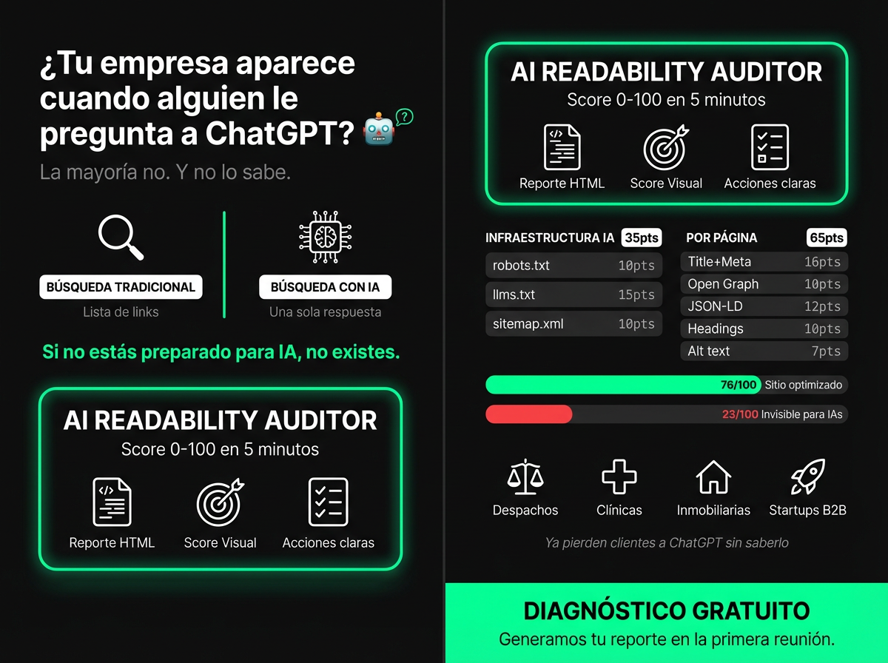

# AI Readability Auditor



Analiza cualquier sitio web y genera un reporte de diagnóstico: **¿qué tan bien puede leer e interpretar este sitio una Inteligencia Artificial?**

El resultado es un reporte visual con score de 0 a 100, hallazgos concretos y una lista de acciones prioritarias para mejorar.

---

## El contexto que lo hace relevante

Hoy, cuando alguien busca un servicio usando ChatGPT, Perplexity, Google AI Overview o cualquier asistente con IA, el motor no ve el sitio web como lo ve un humano. Rastrea el código fuente, los archivos de configuración y la estructura del contenido. Si el sitio no está preparado para ser leído por IAs, **simplemente no aparece en esas respuestas**.

Esto es el equivalente del SEO de los años 2000 — pero para la era de la IA. La mayoría de empresas no sabe que tiene este problema.

---

## Beneficios para la consultoría

**Puerta de entrada a nuevos clientes**
Se ofrece gratis como diagnóstico inicial. En 5 minutos se genera un reporte profesional que demuestra autoridad técnica sin haber firmado ningún contrato.

**Diferenciación inmediata**
Pocas consultorías ofrecen esto hoy. Posiciona a la consultoría en la conversación de "IA y visibilidad digital" antes que la competencia.

**Argumento de venta tangible**
El reporte tiene números. El cliente ve de inmediato que hay trabajo por hacer — no es una opinión, es un diagnóstico objetivo.

**Upsell natural**
El reporte entrega el *qué*. La consultoría entrega el *cómo arreglarlo*. Cada hallazgo es una conversación de ventas.

---

## Beneficios para los clientes

| Problema que resuelve | Resultado concreto |
|---|---|
| Mi empresa no aparece cuando alguien le pregunta a ChatGPT sobre mi industria | Mayor visibilidad en búsquedas con IA |
| No sé si mi sitio está bien estructurado para buscadores modernos | Diagnóstico claro con score y prioridades |
| Invertí en SEO pero los resultados AI no me muestran | Identificación de los bloqueadores específicos |
| No tengo presupuesto para una auditoría larga | Reporte en minutos, costo de entrada bajo |

---

## Dónde aplicar esta herramienta

**Clientes ideales:**
- Despachos de abogados, contadores, médicos — sectores donde ChatGPT ya está redirigiendo consultas
- Negocios locales con competencia fuerte online (restaurantes, clínicas, inmobiliarias)
- Startups B2B que venden a través de su sitio y necesitan ser encontradas por compradores que usan IA para investigar

**Momento de uso:**
- Primer contacto con prospecto — como "regalo" de diagnóstico
- Cierre de propuesta — para justificar el alcance técnico del trabajo
- Entrega de proyecto — como métrica de éxito antes/después

---

## ¿Qué audita?

**Nivel dominio (35 pts)**
- `robots.txt` (10): existe, tiene User-agent, no bloquea GPTBot/Claude-Web/Bard
- `llms.txt` (15): existe, tiene `# título` + `## secciones` + links https://
- `sitemap.xml` (10): existe, URLs con `<lastmod>`

**Nivel página, promediado (65 pts)**
- `<title>` (8): presente, <60 chars
- `<meta description>` (8): presente, <160 chars
- Open Graph (10): og:title + og:description + og:image
- JSON-LD (12): presente y válido
- Headings (10): 1 h1, jerarquía h1→h2→h3 sin saltos
- Alt text (7): todas las imágenes con alt
- Texto/HTML ratio (5): >15%
- Tiempo de respuesta (3): <2000ms
- Tamaño de página (2): <500KB

---

## Instalación

```bash
npm install
```

## Uso

```bash
# Auditar un dominio
npx tsx auditor.ts https://ejemplo.com

# Limitar páginas auditadas
npx tsx auditor.ts https://ejemplo.com --pages 5

# Sitios con SSL inválido o autofirmado
npx tsx auditor.ts https://sitio.com --no-verify
```

Genera `audit-report-<dominio>-<fecha>.html` en el directorio actual.  
Abre en Chrome → `Cmd+P` → Guardar como PDF.

## Tests

```bash
npm test
```

21 tests unitarios cubriendo los 6 módulos de checks.
