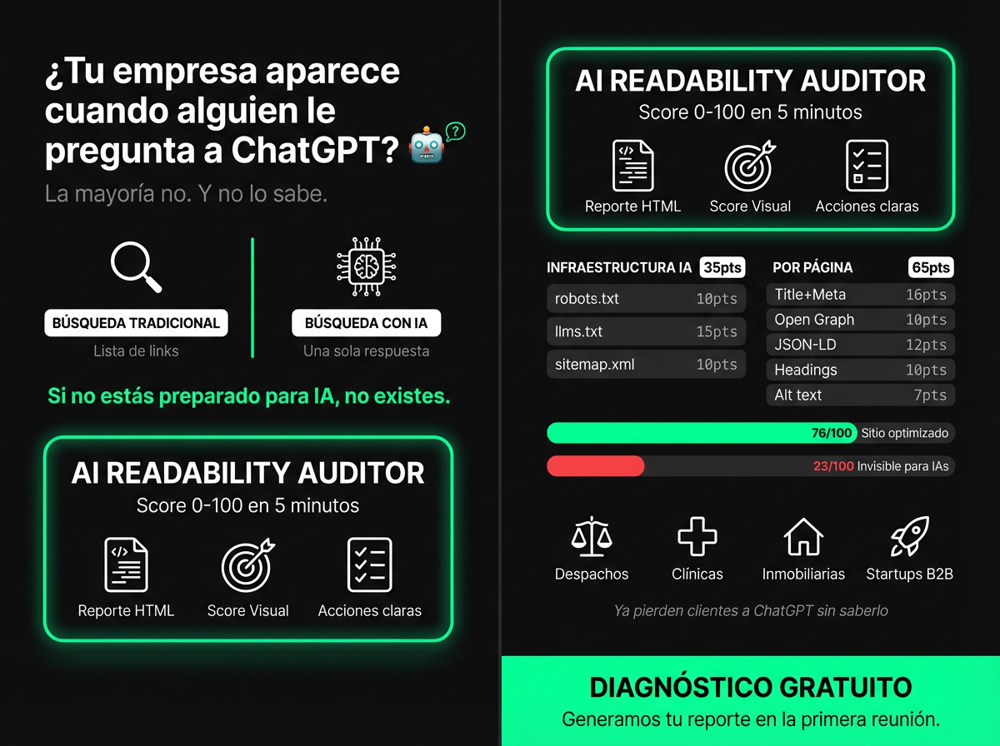

# AI Readability Auditor



Analiza cualquier sitio web y genera un reporte de diagnóstico: **¿qué tan bien puede leer e interpretar este sitio una Inteligencia Artificial?**

El resultado es un reporte visual con score de 0 a 100, hallazgos concretos y una lista de acciones prioritarias para mejorar.

---

## El contexto que lo hace relevante

Hoy, cuando alguien busca un servicio usando ChatGPT, Perplexity, Google AI Overview o cualquier asistente con IA, el motor no ve el sitio web como lo ve un humano. Rastrea el código fuente, los archivos de configuración y la estructura del contenido. Si el sitio no está preparado para ser leído por IAs, **simplemente no aparece en esas respuestas**.

Esto es el equivalente del SEO de los años 2000 — pero para la era de la IA. La mayoría de empresas no sabe que tiene este problema.

---

## Beneficios para la consultoría

**Puerta de entrada a nuevos clientes**
Se ofrece gratis como diagnóstico inicial. En 5 minutos se genera un reporte profesional que demuestra autoridad técnica sin haber firmado ningún contrato.

**Diferenciación inmediata**
Pocas consultorías ofrecen esto hoy. Posiciona a la consultoría en la conversación de "IA y visibilidad digital" antes que la competencia.

**Argumento de venta tangible**
El reporte tiene números. El cliente ve de inmediato que hay trabajo por hacer — no es una opinión, es un diagnóstico objetivo.

**Upsell natural**
El reporte entrega el *qué*. La consultoría entrega el *cómo arreglarlo*. Cada hallazgo es una conversación de ventas.

---

## Beneficios para los clientes

| Problema que resuelve | Resultado concreto |
|---|---|
| Mi empresa no aparece cuando alguien le pregunta a ChatGPT sobre mi industria | Mayor visibilidad en búsquedas con IA |
| No sé si mi sitio está bien estructurado para buscadores modernos | Diagnóstico claro con score y prioridades |
| Invertí en SEO pero los resultados AI no me muestran | Identificación de los bloqueadores específicos |
| No tengo presupuesto para una auditoría larga | Reporte en minutos, costo de entrada bajo |

---

## Dónde aplicar esta herramienta

**Clientes ideales:**
- Despachos de abogados, contadores, médicos — sectores donde ChatGPT ya está redirigiendo consultas
- Negocios locales con competencia fuerte online (restaurantes, clínicas, inmobiliarias)
- Startups B2B que venden a través de su sitio y necesitan ser encontradas por compradores que usan IA para investigar

**Momento de uso:**
- Primer contacto con prospecto — como "regalo" de diagnóstico
- Cierre de propuesta — para justificar el alcance técnico del trabajo
- Entrega de proyecto — como métrica de éxito antes/después

---

## ¿Qué audita?

**Nivel dominio (35 pts)**
- `robots.txt` (10): existe, tiene User-agent, no bloquea GPTBot/Claude-Web/Bard
- `llms.txt` (15): existe, tiene `# título` + `## secciones` + links https://
- `sitemap.xml` (10): existe, URLs con `<lastmod>`

**Nivel página, promediado (~102 pts)**

*Meta (38 pts)*
- `<title>` (8): presente, <60 chars
- `<meta description>` (8): presente, <160 chars
- Open Graph (10): og:title + og:description + og:image
- JSON-LD (12): presente y válido

*Contenido (27 pts)*
- Headings (10): 1 h1, jerarquía h1→h2→h3 sin saltos
- Alt text (7): todas las imágenes con alt
- HTML semántico (5): landmarks `<main>`, `<article>`, `<nav>`, `<section>`
- Texto/HTML ratio (5): >15%

*Performance (5 pts)*
- Tiempo de respuesta (3): <2000ms
- Tamaño de página (2): <500KB

*GEO — Generative Engine Optimization (32 pts)*
- Contenido citable (8): estadísticas, porcentajes, años, fuentes entre paréntesis, cifras con contexto
- Q&A density (8): headings interrogativos (`¿Cómo...?`, `What is...?`), `<details>`/`<summary>`, schema FAQPage
- E-E-A-T (10): links a fuentes autoritativas (.gov, .edu, Wikipedia), autoría explícita, fecha de publicación
- Densidad semántica (6): coherencia Jaccard entre términos del H1 y el cuerpo del texto

---

## Arquitectura

```
ai-auditor/
├── auditor.ts          # CLI — entry point, orquesta checks, genera HTML
├── reporter.ts         # Genera el reporte HTML autocontenido
├── types.ts            # Tipos compartidos (CheckResult, PageAudit, DomainAudit)
├── checks/             # Módulos de auditoría
│   ├── robots.ts
│   ├── llms.ts
│   ├── sitemap.ts
│   ├── meta.ts
│   ├── content.ts
│   ├── geo.ts
│   ├── performance.ts
│   └── __tests__/
├── web/                # Interfaz web (Next.js 15)
│   ├── app/
│   │   ├── page.tsx              # Landing page + auditor UI
│   │   └── api/
│   │       ├── audit/route.ts    # SSE streaming del audit
│   │       └── verify-email/route.ts  # Verificación de acceso
│   ├── lib/
│   │   ├── run-audit.ts          # Lógica de auditoría reutilizable
│   │   ├── supabase.ts           # Cliente Supabase (server-side)
│   │   └── checks/               # Copia de checks para el web runtime
│   └── vercel.json               # Timeout 60s para función de audit
└── supabase/
    ├── setup.sql                 # Crear tabla authorized_emails
    └── migration_audit_count.sql # Agregar columnas de conteo
```

**Score model:** `globalScore = domainScore + avgPageScore`. El porcentaje mostrado es `globalScore / globalMaxScore * 100`.

**Acceso controlado:** Los usuarios se verifican contra una tabla `authorized_emails` en Supabase. Cada email tiene un límite de auditorías (`max_audits`, default 5). El contador solo puede resetearse directamente en la tabla.

---

## Instalación (CLI)

```bash
# Desde la raíz del proyecto
pnpm install
```

### Uso CLI

```bash
# Auditar un dominio
pnpm run audit -- https://ejemplo.com

# Limitar páginas auditadas
pnpm run audit -- https://ejemplo.com --pages 5

# Sitios con SSL inválido o autofirmado
pnpm run audit -- https://sitio.com --no-verify
```

Genera `audit-report-<dominio>-<fecha>.html` en el directorio actual.  
Abre en Chrome → `Ctrl+P` → Guardar como PDF.

---

## Interfaz Web (Next.js)

### Desarrollo local

```bash
cd web
pnpm install
cp .env.local.example .env.local   # completar con tus credenciales
pnpm dev                            # http://localhost:3000
```

### Variables de entorno requeridas

```env
SUPABASE_URL=https://<project-ref>.supabase.co
SUPABASE_SERVICE_KEY=<service_role_key>
```

### Setup de Supabase

1. Crear proyecto en [supabase.com](https://supabase.com)
2. Ejecutar en **SQL Editor**:

```sql
CREATE TABLE authorized_emails (
  email       text        PRIMARY KEY,
  name        text,
  audit_count integer     DEFAULT 0,
  max_audits  integer     DEFAULT 5,
  created_at  timestamptz DEFAULT now()
);
```

3. Agregar usuarios autorizados:

```sql
INSERT INTO authorized_emails (email, name) VALUES ('usuario@empresa.com', 'Nombre');
```

4. Resetear contador de un usuario:

```sql
UPDATE authorized_emails SET audit_count = 0 WHERE email = 'usuario@empresa.com';
```

---

## Deploy en VPS (producción actual)

La interfaz web está desplegada en **auditor.clariifica.com** vía Docker + GitHub Actions + VPS Hetzner (CPX21, Ubuntu 24.04, Dokploy + Traefik).

### Pipeline CI/CD automático

Cada `git push` a `main` dispara:

```
Pre-deploy (typecheck) → Build & push Docker → Deploy to VPS → Smoke test
```

Definido en `.github/workflows/docker-build.yml`. Build context: `./web`.

### Secrets requeridos en GitHub Actions

`Settings → Secrets → Actions` del repositorio:

| Secret | Valor |
|--------|-------|
| `VPS_HOST` | IP del servidor |
| `VPS_USER` | Usuario SSH |
| `VPS_SSH_KEY` | Clave SSH privada |

> No necesita `NEXT_PUBLIC_*` — todas las vars son server-side y van en el env file del servidor.

### Variables de entorno en el servidor

Crear `/etc/ai-auditor.env` con permisos `600`:

```env
NODE_ENV=production
PORT=3000
SUPABASE_URL=https://tu-proyecto.supabase.co
SUPABASE_SERVICE_KEY=eyJ...
```

```bash
scp ai-auditor.env user@vps:/home/user/ai-auditor.env
ssh user@vps "sudo mv ~/ai-auditor.env /etc/ai-auditor.env && sudo chmod 600 /etc/ai-auditor.env"
```

### Notas de build (gotchas)

- **`supabase.ts` usa fallback en build time.** `createClient` recibe placeholder values durante `next build` (cuando las vars no están disponibles). En runtime siempre habrá vars reales vía `--env-file`.
- **`web/public/` debe existir aunque esté vacío.** El Dockerfile copia ese directorio — sin él, el build falla en la etapa final. El `.gitkeep` lo mantiene en el repo.
- **Lockfile debe generarse con versiones exactas.** El `package.json` usa versiones pinneadas (sin `^`). Si se agregan deps con rangos, regenerar con `pnpm install` antes de commitear.
- **`--dns 8.8.8.8` en `docker run`.** Containers en `dokploy-network` no resuelven DNS externo por defecto. El workflow ya lo incluye.

---

## Tests

```bash
pnpm test
```

36 tests unitarios cubriendo los 7 módulos de checks.
